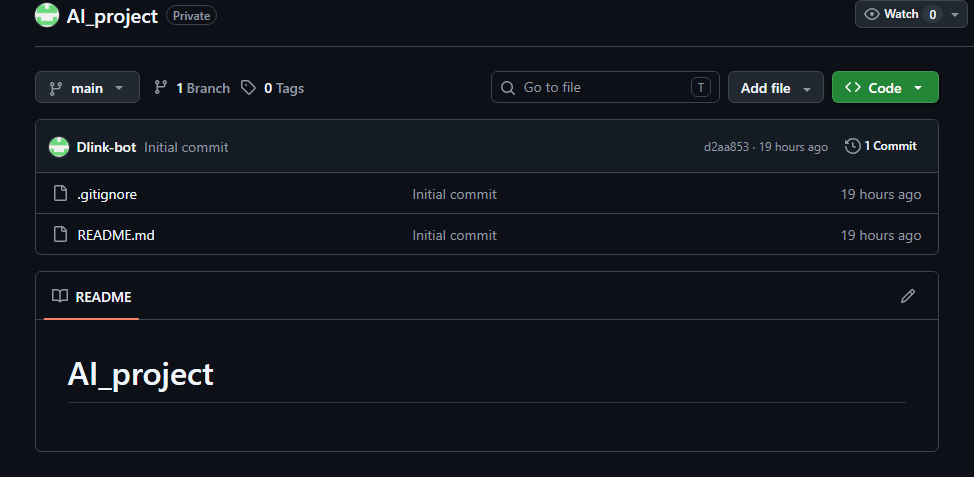
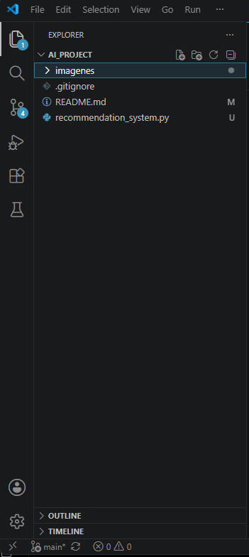
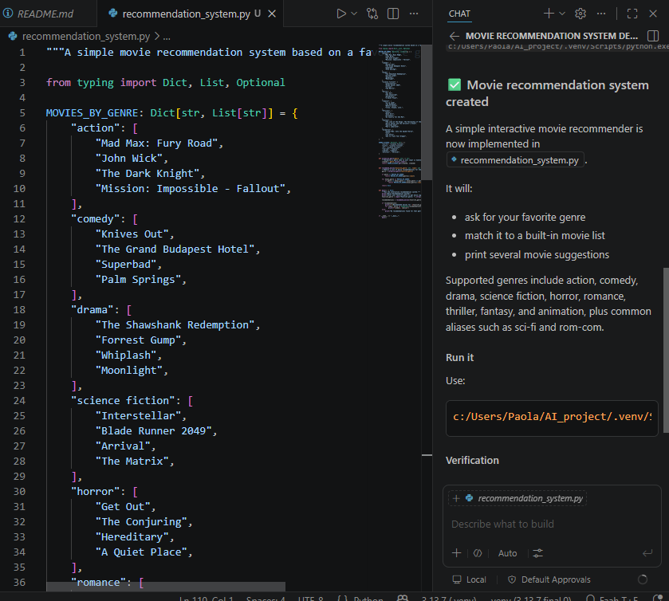
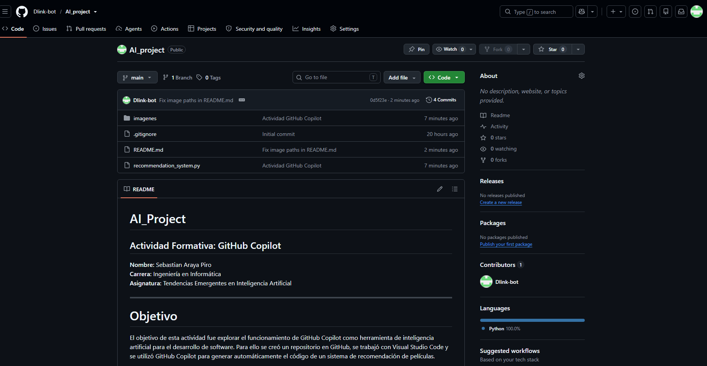

# AI_Project

## Actividad Formativa: GitHub Copilot

**Nombre:** Sebastian araya piro  
**Carrera:** Ingeniería en Informática  
**Asignatura:** Tendencias Emergentes en Inteligencia Artificial

---

# Objetivo

El objetivo de esta actividad fue explorar el funcionamiento de GitHub Copilot como herramienta de inteligencia artificial para el desarrollo de software. Para ello se creó un repositorio en GitHub, se trabajó con Visual Studio Code y se utilizó GitHub Copilot para generar automáticamente el código de un sistema de recomendación de películas.

---

# Herramientas utilizadas

- GitHub
- Git
- Visual Studio Code
- GitHub Copilot
- Python

---

# Desarrollo de la actividad

## 1. Creación de la cuenta

Se ingresó a GitHub y se inició sesión con la cuenta personal.

## 2. Creación del repositorio

Se creó un repositorio llamado **AI_Project**, agregando un archivo README y un archivo `.gitignore`.

### Captura



---

## 3. Clonación del repositorio

Se clonó el repositorio desde GitHub utilizando Git y Visual Studio Code mediante el comando:

```bash
git clone https://github.com/Dlink-bot/AI_project.git
```

### Captura



---

## 4. Creación del archivo

Se creó el archivo:

```

recommendation_system.py

```

Dentro del proyecto.

---

## 5. Uso de GitHub Copilot

Se utilizó GitHub Copilot para generar automáticamente un sistema de recomendación de películas a partir de una solicitud realizada desde Visual Studio Code.

El programa generado permite:

- recomendar películas según el género favorito del usuario;
- utilizar listas de películas organizadas por categorías;
- mostrar varias recomendaciones.

### Captura



---

## 6. Guardado de cambios

Una vez terminado el programa, se agregaron los archivos al repositorio mediante Git.

Se utilizaron los siguientes comandos:

```bash
git add .
git commit -m "Actividad GitHub Copilot"
git push origin main
```

### Captura



---

# Resultado obtenido

Se logró crear correctamente un proyecto utilizando GitHub Copilot como asistente de programación. El código fue generado mediante inteligencia artificial y posteriormente almacenado en un repositorio de GitHub.

---

# Conclusión

GitHub Copilot facilita el desarrollo de software al generar código automáticamente a partir de instrucciones escritas por el usuario. Esta herramienta permite aumentar la productividad, reducir el tiempo de programación y servir como apoyo durante el aprendizaje de nuevos lenguajes y tecnologías.

La actividad permitió comprender el funcionamiento básico de GitHub, Git y GitHub Copilot, además de conocer el proceso para crear, documentar y publicar un proyecto utilizando herramientas de desarrollo colaborativo.